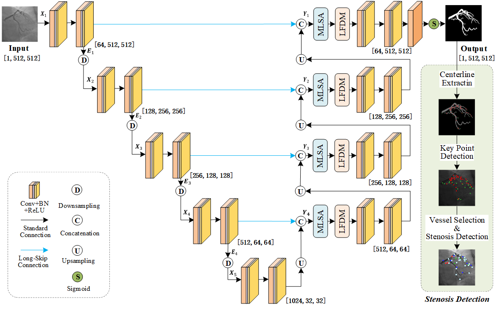

# Frequency-Domain Attention-Guided Diffusion Network (FAD-Net)

## Overview

This project implements an enhanced version of the classic UNet—**FAD-Net**—incorporating two structural improvement modules to boost the model's ability to model multi-scale and frequency features:

**MLSA**(Multi-Level Self-Attention): Effectively captures local and global contexts to enhance robustness to background noise.  
**LFDM**(Low-Frequency Diffusion Module): Enhances the representation of small arterial branches and edges through multi-level wavelet transforms. 

This network is particularly well-suited for fine-grained visual tasks such as medical image segmentation and structure-aware enhancement.

---

## Architecture Overview


The overall architecture is an asymmetric U-shape, with MLSA and LFDM introduced in the decoder to enhance modeling.


---

## Modules Explained

### Conv_Block  
A standard convolution module comprising two combinations of Conv2d + BatchNorm + Dropout + LeakyReLU.

### Downsample / Upsample  
Downsample: Uses convolution with stride=2 for spatial compression.  
Upsample: Employs nearest neighbor interpolation upsampling followed by concatenation with encoder feature maps.  

### MLSA (Multi-Level Self-Attention)  
Inserted after each jump connection, MLSA applies Fourier transforms to query (Q) and key (K) features. By computing similarities across different frequency bands, MLSA enables spectrum-driven attention, effectively capturing local and global contexts.

### LFDM (Low-Frequency Diffusion Module) 
Used in parallel with MLSA, LFDM decomposes feature maps through multi-level wavelet transforms and adopts learnable scaling factors to progressively enhance low-frequency subbands encoding the overall arterial tree topology. This allows for a collaborative highlight of the global vascular topology while preserving complex vascular features.

---

## Quick Start

```python
from net import FAD_Net
import torch

model = FAD_Net()
x = torch.randn(2, 1, 512, 512)  # Input: grayscale 
y = model(x)
print(y.shape)  # Output: [2, 1, 512, 512]
```

---

## Requirements

Below are the versions of Python packages required to run this model:

```ini
torch==2.3.1+cu118
torchvision==0.18.1+cu118
monai==1.4.0
timm==1.0.15
einops==0.8.0
matplotlib==3.9.4
scikit-learn==1.6.1
scikit-image==0.24.0
pillow==11.1.0
opencv-python==4.11.0.86
pytorch-wavelets==1.3.0
```

Installation:

```bash

pip install -r requirements.txt
```

---
## Data Structure

To ensure the project runs smoothly, please organize your data according to the following structure:

```bash

project_root/
├── dataset/
│   ├── train/
│   │   ├── ICA_PNG/
│   │   └── label/
│   └── test/
│       ├── ICA_PNG/
│       └── label/
├── weight/
├── results_txt/
├── outputs/
└── ...
```

---
## Code Structure

```bash

.
├── data.py
├── net.py           # Main model definition (FAD-Net)
├── MLSA.py          # Multi-Level Self-Attention
├── LFDM.py          # Low-Frequency Diffusion Module
├── README.md
└── ...
```

---

## Citations

If this project is helpful to your research, please cite this repository or the related methods.

```latex
@misc{chen2025fadnet,
  title={FAD-Net: Frequency-Domain Attention-Guided Diffusion Network for Coronary Artery Segmentation using Invasive Coronary Angiography},
  author={Nan Mu et al.},
  year={2025},
  note={\url{https://github.com/chenzhao2023/FAD_Net_ICA_BinarySeg}}
}
```
